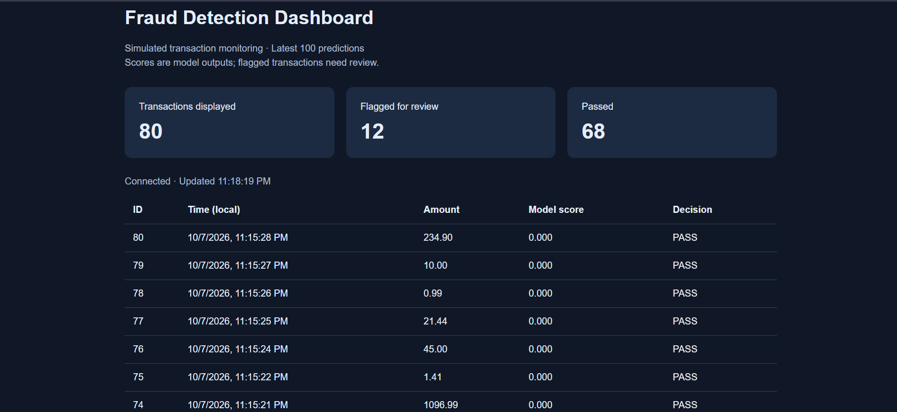

# Real-Time Fraud Detection

A local transaction-monitoring application that uses a Random Forest model to score credit-card transactions, flag suspicious activity, and display predictions on a live dashboard.

Incoming transactions are simulated by replaying historical data through a FastAPI service.

## Dashboard



## Features

- Data cleaning and exploratory analysis.
- Logistic regression and Random Forest model comparisons.
- Transaction scoring through a FastAPI endpoint.
- Input validation for transaction amounts and features.
- SQLite storage of predictions and review decisions.
- Dashboard that refreshes every two seconds.

## Technology

Python, pandas, scikit-learn, FastAPI, Pydantic, SQLite, HTML, CSS, and JavaScript.

## How It Works

1. The simulator sends a transaction to the API.
2. The API validates the input and preserves the training feature order.
3. The saved model produces a fraud score.
4. Scores of 0.5 or higher trigger a REVIEW decision.
5. The prediction is saved in SQLite.
6. The dashboard retrieves and displays the latest 100 predictions.

## Dataset and Evaluation

The dataset contains 284,807 transactions. Removing 1,081 duplicate rows leaves 283,726 transactions with approximately 0.17% fraud.

The model uses 30 input features: Time, Amount, and V1 through V28. Class is the target label and is excluded from prediction inputs.

A stratified split with random_state=42 assigns 80% of transactions to training and 20% to testing.

### Random Forest Test Results

| Metric | Result |
|---|---:|
| Fraud precision | 97.18% |
| Fraud recall | 72.63% |
| Fraud F1 score | 83.13% |
| Average precision | 0.7876 |
| Fraud correctly detected | 69 |
| Fraud missed | 26 |
| Legitimate transactions flagged | 2 |
| Legitimate transactions passed | 56,649 |

The model was evaluated on 56,746 held-out transactions, including 95 fraud cases. Baseline logistic regression achieved approximately 58% fraud recall.

## Run Locally

The project was run using Python 3.11.9 on Windows.

### 1. Clone the repository

```powershell
git clone https://github.com/AgnesJohn17/Real-time-fraud-detection.git
cd Real-time-fraud-detection
```

### 2. Create an environment and install dependencies

```powershell
python -m venv .venv
.\.venv\Scripts\python.exe -m pip install -r requirements.txt
```

### 3. Add the dataset

The dataset is not included in this repository.

Create the data/raw folder and place creditcard.csv inside it:

```text
data/raw/creditcard.csv
```

The CSV must contain Time, V1 through V28, Amount, and Class.

### 4. Train and save the model

Run from the main project folder:

```powershell
.\.venv\Scripts\python.exe src/train_model.py
```

This prints evaluation results and saves models/fraud_model.joblib.

### 5. Start the API

```powershell
.\.venv\Scripts\python.exe -m uvicorn src.api:app --reload
```

Keep this terminal running.

- Dashboard: http://127.0.0.1:8000/
- Interactive API documentation: http://127.0.0.1:8000/docs
- Health check: http://127.0.0.1:8000/health

### 6. Replay transactions

Open a second terminal in the project folder:

```powershell
.\.venv\Scripts\python.exe src/simulate_transactions.py
```

The script sends 20 transactions, one second apart. Watch the dashboard update automatically.

## API Endpoints

| Method | Endpoint | Purpose |
|---|---|---|
| GET | / | Dashboard |
| GET | /health | Service readiness |
| POST | /predict | Score and save a transaction |
| GET | /transactions | Latest 100 saved predictions |

The prediction request contains Time, Amount, and a features list containing exactly 28 values in V1-to-V28 order.

Responses include fraud_score, threshold, flagged, and decision.

## Limitations

- This is a local prototype using historical replay, not a live bank integration.
- The demonstration deliberately includes 15 legitimate and 5 fraudulent transactions. This does not represent the dataset's natural fraud rate.
- Replaying the script adds new database records for the same examples.
- Dashboard counts describe the latest 100 predictions, not lifetime totals.
- A PASS decision does not guarantee that a transaction is legitimate.
- Model scores are not calibrated fraud probabilities.
- The random train/test split does not establish performance on future transactions.
- Predictions require the anonymized V1–V28 features; an amount alone is insufficient.
- Dependency versions are not pinned, so results may vary across environments.
- Authentication, automated tests, and production deployment are future improvements.